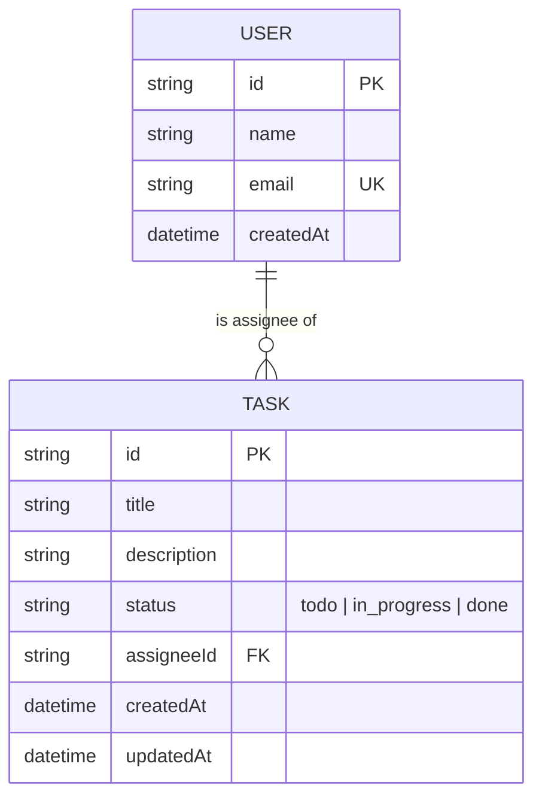

# Team Task Board

A small full-stack task-tracking app: NestJS + Prisma (SQLite) on the backend,
React + Redux Toolkit + MUI on the frontend.

Time spent: **~4 hours** (1h debugging the SQLite/Prisma enum issue, 1h30m reviewing the generated code, 1h30m on the unit tests)

## Stack

- **Backend:** NestJS, Prisma ORM, SQLite, class-validator
- **Frontend:** React, Redux Toolkit (RTK Query), MUI
- **Language:** TypeScript throughout

## Data model & ER diagram

Two related entities, `User` and `Task`, in a **1:many** relationship: a `User`
can be the assignee on many `Task`s, and each `Task` has at most one assignee.
`assigneeId` is nullable so a task can exist unassigned — creating a task never
blocks on picking someone first, which matches how a real board actually gets
used (triage first, assign later).



## Running the project

Requires Node.js 20+.

### 1. Backend (NestJS + Prisma + SQLite)

```bash
cd backend
npm install
cp .env.example .env          # DATABASE_URL="file:./dev.db"
npx prisma migrate dev --name init   # creates prisma/dev.db + applies the schema
npx prisma db seed                   # optional: a few sample users/tasks
npm run start:dev                    # http://localhost:3000/api
```

Run the tests:

```bash
npm test           # unit tests (TasksService, mocked Prisma)
npm run test:e2e   # e2e tests against a real SQLite test DB (prisma/test.db)
```

### 2. Frontend (React + Redux + MUI)

```bash
cd frontend
npm install
cp .env.example .env          # VITE_API_URL=http://localhost:3000/api
npm run dev                          # http://localhost:5173
```

With both running, open http://localhost:5173 — the board talks to the real
NestJS API, no mocked data.

### API summary

| Method | Path                | Description                                  |
| ------ | -------------------- | --------------------------------------------- |
| GET    | `/api/tasks`          | List tasks, optional `?status=` & `?assigneeId=` |
| GET    | `/api/tasks/:id`      | Get one task                                  |
| POST   | `/api/tasks`          | Create a task                                 |
| PATCH  | `/api/tasks/:id`      | Update a task's title/description/assignee    |
| PATCH  | `/api/tasks/:id/status` | Update a task's status                      |
| DELETE | `/api/tasks/:id`      | Delete a task                                 |
| GET    | `/api/users`          | List users (for the assignee dropdown)        |

## Decisions & Tradeoffs

I modeled `User`→`Task` as a nullable 1:many rather than `Task`↔`Project`,
since the brief's own example ("Task and User (assignee)") maps directly onto
what a real team board needs, and a nullable FK keeps task creation
unblocked. Status changes get their own `PATCH /tasks/:id/status` endpoint
and DTO, separate from the general `PATCH /tasks/:id` edit — that mirrors how
the frontend actually uses it (a single dropdown action) and keeps the two
DTOs small and single-purpose instead of one large "update anything" DTO. I
picked a status **dropdown** per card over drag-and-drop columns: same
functionality, no extra drag library or drop-target wiring, and it's fully
keyboard-accessible for free. For state management I used RTK Query instead
of hand-rolled thunks — it gave me caching, loading/error states, and
tag-based invalidation (e.g. deleting a task automatically refreshes the
list) with very little boilerplate, which felt like the right idiomatic
choice for "Redux Toolkit is fine." Filtering is server-side (`GET
/tasks?status=&assigneeId=`) rather than client-side, so it scales the same
way a real backlog would. Backend tests are split deliberately: unit tests
mock Prisma entirely to test `TasksService`'s branching (404s, filter
pass-through) in isolation, while the e2e suite runs the real NestJS app
against a throwaway SQLite file to prove the whole request/response cycle
and validation pipeline actually works. With more time I'd add task editing
(title/description) in the UI — the `PATCH /tasks/:id` endpoint already
supports it, the frontend just doesn't expose a form for it yet — plus
pagination once a board has hundreds of tasks, and I'd swap the status
`<Select>` for real drag-and-drop if the reviewer wanted that interaction
model. I intentionally skipped auth (per the brief), a shadow database for
migration diffing (SQLite + a single dev don't need it), and toast/snackbar
notifications on mutation errors beyond an inline `Alert` in the create-task
dialog.

## Project structure

```
backend/
  prisma/schema.prisma       # User, Task models + TaskStatus enum
  prisma/seed.ts             # sample data
  src/tasks/                 # module, controller, service, DTOs
  src/users/                 # module, controller, service (read-only)
  src/prisma/                # PrismaService/PrismaModule
  test/tasks.e2e-spec.ts     # e2e tests (real SQLite DB)

frontend/
  src/app/                   # store, RTK Query api slice, typed hooks
  src/features/tasks/        # board, columns, cards, filters, create form
```

---

**Note on how this was built:** I used Claude to scaffold and pair-program
this project. Before submitting, please fill in the actual time spent above,
and make sure you can walk through every decision above comfortably for the
follow-up call — that's the part that actually matters.
